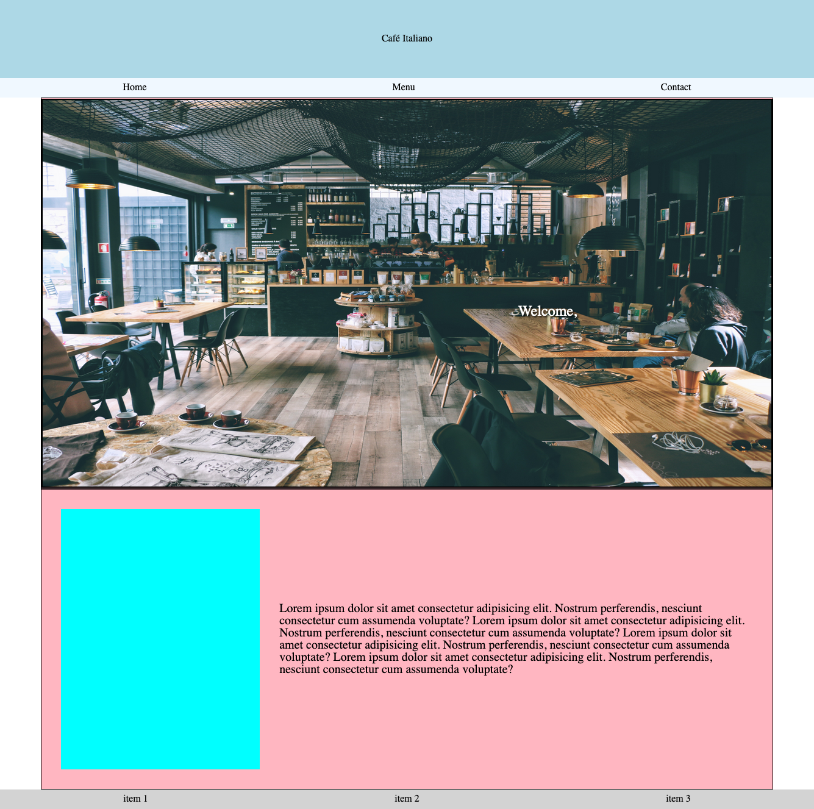

# Restaurant Page

## Description

This repository contains my code for the 'Restaurant Page' project found in The Odin Project's JavaScript course.

## Built With

-    
-    
- 

## License

- Distributed under the MIT License. See `LICENSE` for more information.

## Author

